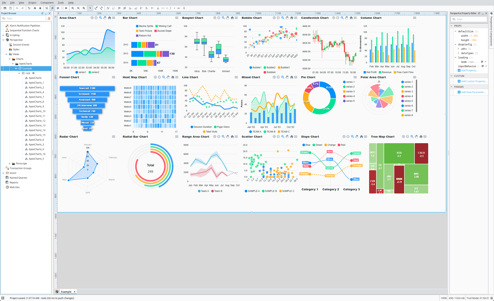

# ApexCharts

[ApexCharts] renders charts using SVG instead of canvas, offering crisp, scalable visuals and seamless CSS styling.
While not as fast as canvas for massive datasets, SVG enables rich interactivity, easier DOM manipulation, and high-quality graphics across a wide range of chart types.

## Properties

<APITable>

| Name | Description | Property Type |
| -- | -- | -- |
| `type` | Chart type. | `string` |
| `options` | Chart options. | `object` |
| `series` | Chart data. | `object` |
| `redraw` | When enabled, tear down and redraw chart on every update | `boolean` |
| `events` | JavaScript chart events. | `object` |
| `style` | Use styles to customize the visual style of the component. Full menu of style options is available for text, background, margin and padding, border, shape and miscellaneous. You can also specify a style class. | `object` |

</APITable>

## Component Configuration

Details on how to configure the component can be found on the [ApexCharts documentation site][ApexCharts documentation].
All configurations supported by ApexCharts are supported on the Perspective component.

Only configuration details specific to this module are provided here.

<DocCardList />

[ApexCharts]: https://apexcharts.com/
[ApexCharts documentation]: https://apexcharts.com/docs/