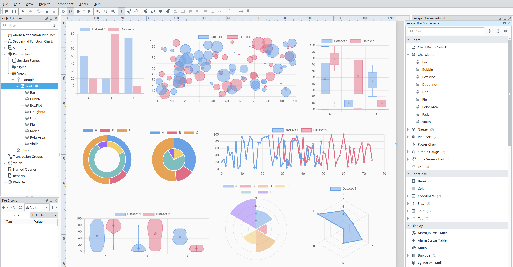

# Chart.js

[Chart.js] renders chart elements on an HTML5 canvas unlike other D3.js-based charting libraries that render as SVG.
Canvas rendering makes Chart.js very performant, especially for large datasets and complex visualizations that would otherwise require thousands of SVG nodes in the DOM tree.

## Properties

<APITable>

| Name | Description | Property Type |
| -- | -- | -- |
| `type` | Chart type. | `string` |
| `data` | Chart data. | `object` | 
| `options` | Chart options. | `object` |
| `events` | JavaScript chart events. | `object` |
| `plugins` | Manually registered plugins | `object` | 
| `redraw` | When enabled, tear down and redraw chart on every update | `boolean` | 
| `updateMode` | A mode string to indicate which transition configuration should be used | `enum` | 
| `style` | Use styles to customize the visual style of the component. Full menu of style options is available for text, background, margin and padding, border, shape and miscellaneous. You can also specify a style class. | `object` | 

</APITable>

## Component Configuration

Details on how to configure the component can be found on the [Chart.js documentation site][Chart.js documentation].
All configurations supported by Chart.js are supported on the Perspective component.

Only configuration details specific to this module are provided here.

<DocCardList />

[Chart.js]: https://www.chartjs.org/
[Chart.js documentation]: https://www.chartjs.org/docs/latest/
[Chart.js Addons]: https://github.com/chartjs/awesome